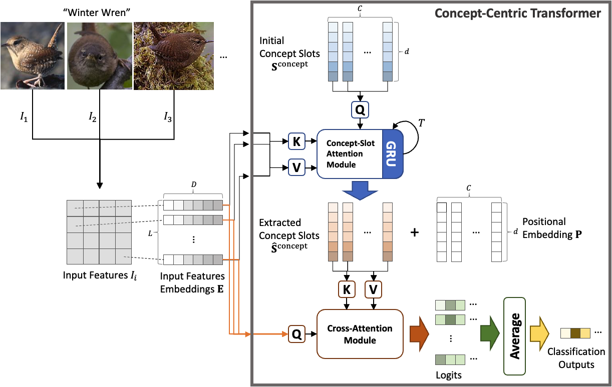

# Concept Centric Transformer
This is the official implementation of Concept-Centric Transformers.


## Abstract
Attention mechanisms have greatly improved the performance of deep-learning models on visual, NLP, and multimodal tasks while also providing tools to aid in the model's interpretability. 
In particular, attention scores over input regions or concrete image features can be used to measure how much the attended elements contribute to the model inference. 
The recently proposed Concept Transformer (CT) generalizes the Transformer attention mechanism from such low-level input features to more abstract, intermediate-level latent concepts that better allow human analysts to more directly assess an explanation for the reasoning of the model about any particular output classification. 
However, the concept learning employed by CT implicitly assumes that across every image in a class, each image patch makes the same contribution to concepts that characterize membership in that class. 
Instead of using the CT's image-patch-centric concepts, object-centric concepts could lead to better classification performance as well as better explainability. 
Thus, we propose *Concept-Centric Transformers (CCT)*, a new family of concept transformers that provides more robust explanations and performance by integrating a novel concept-extraction module based on object-centric learning. 
We test our proposed CCT against the CT and several other existing approaches on classification problems for MNIST (odd/even), CIFAR100 (super-classes), and CUB-200-2011 (bird species). 
Our experiments demonstrate that CCT not only achieves significantly better classification accuracy than all selected benchmark classifiers across all three of our test problems, but it generates more consistent concept-based explanations of classification output when compared to CT.

## Requirments
```bash
pip install -r requirements.txt
```

## Usage
We provide the python files in ```scripts``` to reproduce all experiments in our paper.
All datasets are automatically downloaded if you don't have.

### MNIST Odd/Even

#### With the full training sample and 10 epochs
You can execute our CCT with the lists of GPUs (1, 2, 3) and random seed (1, 2, 3):

```bash
python3 scripts/MNIST_OddEven/slotctc_epochs10.py --gpus 1|2|3 --seeds 1|2|3
```

For CT, you can run ```scripts/MNIST_OddEven/ctc_epochs10.py``` with the same arguements above.

#### With the fewer samples from 100 to 7000
You can execute our CCT with the lists of GPUs (0, 1, 2, 3) and random seed (1, 2, 3):

```bash
python3 scripts/MNIST_OddEven/slotctc_training_samples.py --gpus 0|1|2|3 --seeds 1|2|3
```

For CT, you can run ```scripts/MNIST_OddEven/ctc_training_samples.py``` with the same arguements above.


### CIFAR100 Super-class

You can execute ViT-Tiny backbone only:

```bash
python3 scripts/CIFAR100_Superclass/vittiny_backbone.py --gpus 1|2|3 --seeds 1|2|3
```

You can execute our CCT:

```bash
python3 scripts/CIFAR100_Superclass/slotcvittiny.py --gpus 1|2|3 --seeds 1|2|3
```

For CT, you can run ```scripts/CIFAR100_Superclass/cvittiny.py``` with the same arguements above.


### CUB-200-2011


## Acknowledgement
Our source codes are based on:
* [IBM/Concept Transformer](https://github.com/IBM/concept_transformer)
* [Google/Slot Attention](https://github.com/google-research/google-research/tree/master/slot_attention)

## Contributing