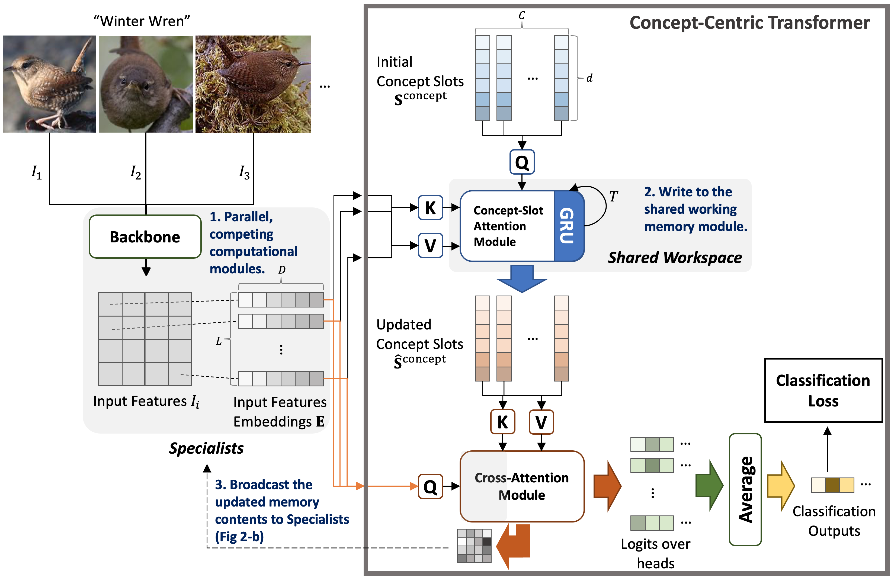
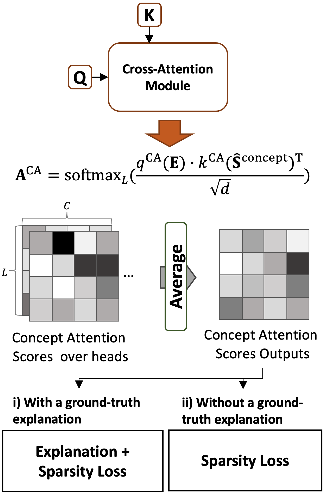

# Concept Centric Transformer
This is the official implementation of Concept-Centric Transformers.
<p float="left">
  
  
</p>

This repository is the official implementation of [concept-centric transformers](https://openaccess.thecvf.com/content/WACV2024/papers/Hong_Concept-Centric_Transformers_Enhancing_Model_Interpretability_Through_Object-Centric_Concept_Learning_Within_WACV_2024_paper.pdf).

## Abstract
To explain "black-box" properties of AI models, many approaches, such as *post hoc* and intrinsically interpretable models, have been proposed to provide plausible explanations that identify human-understandable features/concepts that a trained model uses to make predictions, and attention mechanisms have been widely used to aid in model interpretability by visualizing that information. 
However, the problem of configuring an interpretable model that effectively communicates and coordinates among computational modules has received less attention. 
A recently proposed shared global workspace theory demonstrated that networks of distributed modules can benefit from sharing information with a bandwidth-limited working memory because the communication constraints encourage specialization, compositionality, and synchronization among the modules.
Inspired by this, we consider how such shared working memories can be realized to build intrinsically interpretable models with better interpretability and performance. 
Toward this end, we propose *Concept-Centric Transformers*, a simple yet effective configuration of the shared global workspace for interpretability consisting of: i) an object-centric-based architecture for extracting semantic concepts from input features, ii) a cross-attention mechanism between the learned concept and input embeddings, and iii) standard classification and additional explanation losses to allow human analysts to directly assess an explanation for the model's classification reasoning. 
We test our approach against other existing concept-based methods on classification tasks for various datasets, including CIFAR100 (super-classes), CUB-200-2011 (bird species), and ImageNet, and we show that our model achieves better classification accuracy than all selected methods across all problems but also generates more consistent concept-based explanations of classification output.

## Requirments
```bash
pip install -r requirements.txt
```

## Usage

### CIFAR100 Super-class

You can execute ViT-T backbone only:

```bash
python3 scripts/CIFAR100_Superclass/vittiny_backbone.py --gpus 1|2|3 --seeds 1|2|3 --data_dir YOUR_DATA_PATH
```

You can execute our CCT:

```bash
python3 scripts/CIFAR100_Superclass/slotcvittiny.py --gpus 1|2|3 --seeds 1|2|3 --data_dir YOUR_DATA_PATH
```
We support three configurations of CCTs as follows:
* ViT-T + SA (Default): ```cifar100superclass_slotcvit_sa```
* ViT-T + ISA: ```cifar100superclass_slotcvit_isa```
* Vit-T + BO-QSA: ```cifar100superclass_slotcvit_qsa```

For testing CCTs, specify the above model name that you want to test in line 49 of ```scripts/CIFAR100_Superclass/slotcvittiny.py```.


For CT, you can run ```scripts/CIFAR100_Superclass/cvittiny.py``` with the same arguements above.


### CUB-200-2011

You can execute our CCT:

```bash
python3 scripts/CUB/slotcvit.py --gpus 1|2|3 --seeds 1|2|3 --data_dir YOUR_DATA_PATH/cub2011/
```

We support nine configurations of CCTs as follows:
* ViT-L + SA (Default): ```cub_slotcvit_sa```
* ViT-L + ISA: ```cub_slotcvit_isa```
* ViT-L + BO-QSA: ```cub_slotcvit_qsa```
* SwinT-L + SA: ```cub_slotcswin_sa```
* SwinT-L + ISA: ```cub_slotcswin_isa```
* SwinT-L + BO-QSA: ```cub_slotcswin_qsa```
* ConvNeXt-L + SA: ```cub_slotc_convnext_sa```
* ConvNeXt-L + ISA: ```cub_slotc_convnext_isa```
* ConvNeXt-L + BO-QSA: ```cub_slotc_convnext_qsa```

For testing CCTs, specify the above model name that you want to test in line 51 of ```scripts/CUB/slotcvit.py``` with the hyperparameters.
Please check the detail of hyperparameter setup for each model in Appendix of our paper.

For CT, you can run ```scripts/CUB/cvit.py``` with the same arguements above.


### ImageNet

You can execute ViT-S backbone only:

```bash
python3 scripts/ImageNet/vitsmall_backbone.py --gpus 1|2|3 --seeds 1|2|3 --data_dir YOUR_DATA_PATH/imagenet/
```

You can execute our CCT:

```bash
python3 scripts/ImageNet/slotcvit.py --gpus 1|2|3 --seeds 1|2|3 --data_dir YOUR_DATA_PATH/imagenet/
```

We support three configurations of CCTs as follows:
* ViT-S + SA (Default): ```imagenet_slotcvit_small_sa```
* ViT-S + ISA: ```imagenet_slotcvit_small_isa```
* ViT-S + BO-QSA: ```imagenet_slotcvit_small_qsa```

For testing CCTs, specify the above model name that you want to test in line 51 of ```scripts/ImageNet/slotcvit.py```.

For CT, you can run ```scripts/ImageNet/cvit.py```.


## Acknowledgement
Our source codes are based on:
* [IBM/Concept Transformer](https://github.com/IBM/concept_transformer): We compare our model with this as one of the baseline models.
* [Google/Slot Attention](https://github.com/google-research/google-research/tree/master/slot_attention): We leverage it as a working memory module.
* [BO-QSA](https://github.com/YuLiu-LY/BO-QSA): We use it as a working memory module.
* [HuggingFace/pytorch-image-models (timm)](https://github.com/huggingface/pytorch-image-models/tree/main/timm): We employ their backbones, including ViT, SwinT and ConvNeXt.

For visualizing concepts, we refer to the experimental setups from:
* [BotCL](https://github.com/wbw520/BotCL)


## Reference
You can cite our work:
```
@InProceedings{Hong_2024_WACV,
    author    = {Hong, Jinyung and Park, Keun Hee and Pavlic, Theodore P.},
    title     = {Concept-Centric Transformers: Enhancing Model Interpretability Through Object-Centric Concept Learning Within a Shared Global Workspace},
    booktitle = {Proceedings of the IEEE/CVF Winter Conference on Applications of Computer Vision (WACV)},
    month     = {January},
    year      = {2024},
    pages     = {4880-4891}
}
```

